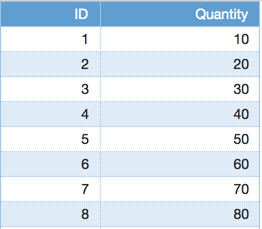

Angular Ag-grid Testing Techniques
==================================

This is a simple example to demonstrate various techniques to test ag-grid in an Angular app, specifically:

1. Visualizing different states of a grid-based component using Storybook
2. Unit testing grid-based components
3. Integration testing (a.k.a. end-to-end testing) an app that uses the ag-grid

A screen shot of the final app is shown below. It contains a single page with an `OrderListComponent` that contains orders.



This project was generated with [Angular CLI](https://github.com/angular/angular-cli) version 6.0.8.

Quick Start
-----------
```bash
$ yarn install  <--- npm install works too
$ ng serve
```

Now point your browser to http://localhost:4200/.


Visual testing
--------------
Allows you to visualize different states of your UI components and develop them interactively.

#### Tools
- [Storybook](https://storybook.js.org/)

#### Tests
- [index.stories.ts](src/stories/index.stories.ts): Instantiates the `OrderListComponent` in two states, empty and filled. This allows you to visually inspect if it is rendered correctly in both states.

#### Running the tests

    yarn storybook
    
Point your browser to http://localhost:6006/


Unit testing
------------
Tests a single component in isolation.

#### Tools
- [Karma](https://karma-runner.github.io/): Test runner
- [Jasmine](https://jasmine.github.io/): Testing framework
- [Angular testing utilities](https://angular.io/guide/testing#testing-utility-apis): TestBed & Component Fixture

#### Tests
- [order-list.component.spec.ts](src/app/order-list/order-list.component.spec.ts): Instantiates the `OrderListComponent` and tests if the columns have the correct titles and the rows have the correct cell values.

#### Running the tests

    ng test


Integration (end-to-end) testing
--------------------------------
Tests the app as a black box.

#### Tools
- [Protractor](http://www.protractortest.org/): Selenium wrapper
- [Jasmine](https://jasmine.github.io/): Testing framework

#### Tests
- [app.e2e-spec.ts](e2e/src/app.e2e-spec.ts): Navigates to the home page and tests if it renders the order list with the correct headers and order values. Uses a [Page Object](e2e/src/app.po.ts) for low level page operations.

#### Running the tests

    ng e2e
